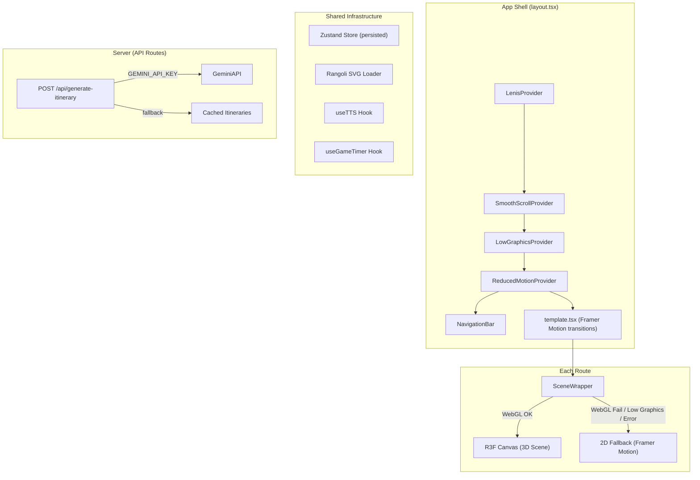

# Chalo Dekhe Bharat! — Implementation Plan

A Next.js 15 immersive 3D tourism platform with five interactive routes, each featuring a full R3F scene with automatic 2D fallback.

> [!IMPORTANT]
> **Build Strategy: Flagship-First.** Museum (both layers) → Landing (both layers) → Gallery → Planner → Game. Every route ships with a working 2D fallback before any 3D work begins on that route.

---

## Proposed Changes

### Phase 0 · Project Scaffold & Design System

#### [NEW] Project initialization
- `npx -y create-next-app@latest ./` with TypeScript strict, App Router, Tailwind, ESLint
- Target: **Next.js 15**, **React 19**, **TypeScript strict mode**

#### [NEW] Package installations (grouped by purpose)
```
# 3D Engine
@react-three/fiber@^9  @react-three/drei@^10  @react-three/postprocessing@^3  @react-three/rapier@^2  three@^0.170  @types/three

# Animation
gsap  @gsap/react  lenis

# State & Validation
zustand  zod

# 2D Motion
motion (framer-motion v12+)

# LLM (Planner)
ai  @ai-sdk/google

# Build tools
node-fetch (build-time Wikimedia script)
```

#### [NEW] `app/globals.css` — Tailwind v4 CSS-first theme
```css
@import "tailwindcss";

@theme {
  /* Color tokens */
  --color-indigo-dusk: #1a1040;
  --color-marble-ivory: #f5f0e8;
  --color-marigold: #f5a623;
  --color-peacock-teal: #00796b;
  --color-sindoor-maroon: #8b1a1a;
  --color-gold-leaf: #c8a951;

  /* Font families (loaded via next/font) */
  --font-display: var(--font-yatra-one);
  --font-body: var(--font-work-sans);
  --font-mono: var(--font-jetbrains-mono);
}
```
No default Tailwind palette classes used anywhere — only custom token classes (e.g., `bg-indigo-dusk`, `text-marigold`).

#### [NEW] `postcss.config.mjs`
```js
export default { plugins: { '@tailwindcss/postcss': {} } };
```

#### [NEW] `app/layout.tsx` — Root layout
- Load fonts via `next/font/google`: Yatra One, Work Sans, JetBrains Mono
- `<LenisProvider>` wrapping `<SmoothScrollProvider>` (GSAP ticker sync)
- `<LowGraphicsProvider>` (context: auto-detect + manual toggle + error boundary)
- `<ReducedMotionProvider>` (reads `prefers-reduced-motion`, kills JS animations)
- Global `<RangoliLoader>` component (SVG stroke-draw mandala transition)
- Meta tags, SEO defaults

#### [NEW] `app/template.tsx` — Route transitions via Framer Motion
- `motion.div` with opacity/y enter/exit transitions
- Rangoli SVG plays between route swaps

---

### Phase 0.5 · Core Infrastructure

#### [NEW] `lib/providers/LowGraphicsProvider.tsx`
- Auto-detect: `navigator.hardwareConcurrency`, `navigator.deviceMemory`, WebGL capability probe (try creating a throwaway WebGL context)
- Three tiers: `full` | `reduced` | `fallback`
- Manual toggle via Zustand store (persisted)
- React error boundary wrapping all R3F `<Canvas>` — catches WebGL/WebGPU init errors → swaps to 2D
- Exposes `useLowGraphics()` hook returning current tier

#### [NEW] `lib/providers/ReducedMotionProvider.tsx`
- Reads `prefers-reduced-motion: reduce` via `matchMedia`
- Provides `useReducedMotion()` hook
- When active: all GSAP timelines `.pause()`, all R3F camera flythroughs skip to final position, rangoli renders static, timers render static

#### [NEW] `lib/providers/SmoothScrollProvider.tsx`
- Lenis instance synced to `gsap.ticker`
- ScrollTrigger.update on lenis scroll event
- Disabled when reduced-motion active

#### [NEW] `components/ui/RangoliLoader.tsx`
- SVG `<path>` mandala with ~8-fold symmetry
- `stroke-dasharray` / `stroke-dashoffset` animation via GSAP
- Used as: page transition overlay, loading state, section divider
- Static render when reduced-motion

#### [NEW] `components/canvas/SceneWrapper.tsx`
- Generic R3F Canvas wrapper with `dynamic(() => import(...), { ssr: false })`
- Accepts `fallback` prop (the 2D version)
- Error boundary integration with `LowGraphicsProvider`
- `gl` config: `antialias`, `alpha`, `powerPreference: 'high-performance'`
- `dpr: [1, 2]` clamped

#### [NEW] `store/appStore.ts` — Zustand global store
- Graphics tier, reduced-motion state, current route, loading state
- `persist` middleware with `hasHydrated` pattern for SSR safety
- Versioned localStorage key: `chalo-dekhe-bharat-v1`

---

### Phase 1 · Digital Museum (Flagship Route)

> [!TIP]
> **This is the flagship.** We build it deepest, then port proven patterns (camera rigs, hotspot system, narration) to other routes.

#### 2D Fallback First

#### [NEW] `app/museum/page.tsx`
- Server component with metadata
- Dynamic import of 3D scene, static fallback always rendered underneath

#### [NEW] `components/museum/MuseumFallback.tsx`
- CSS scroll-snap horizontal wings (7 eras)
- Each era: full-viewport section with background gradient matching era theme
- Interactive hotspot buttons (absolute-positioned over era illustration)
- Timeline navigation bar at bottom (click to jump to era)
- TTS narration controls (play/pause per era)
- Framer Motion layout transitions between eras

#### [NEW] `data/museum-eras.ts` — 7 era data objects
Each era contains:
```ts
{
  id: string;
  title: string;
  period: string;
  narrative: string; // 100-200 words, real historical content
  hotspots: Array<{
    id: string;
    title: string;
    description: string;
    position: [number, number, number]; // 3D coords
    position2D: { x: string; y: string }; // CSS position
  }>;
  themeColors: { primary: string; secondary: string; accent: string };
  architecturalStyle: string; // Used to generate procedural geometry
}
```

**Seven eras with real narrative content:**
1. **Indus Valley (3300–1300 BCE)** — Harappan urban planning, Great Bath, proto-Shiva seals
2. **Mauryan Empire & Ashoka (322–185 BCE)** — Ashoka's edicts, Sanchi stupa, non-violence revolution
3. **Mughal Architecture (1526–1857)** — Taj Mahal, Red Fort, Indo-Islamic fusion
4. **Rajasthani Forts & Jaipur (15th–18th c.)** — Amber Fort, Hawa Mahal, desert citadels
5. **Colonial India (1757–1947)** — Victoria Memorial, railways, the clash of cultures
6. **Independence Movement (1920–1947)** — Salt March, Quit India, midnight's freedom
7. **Living Heritage (present)** — Varanasi ghats, temple festivals, continuity of tradition

#### [NEW] `lib/hooks/useTTS.ts` — Web Speech API hook
- `speechSynthesis` with sentence-level chunking (split on `.` `!` `?`)
- Queue sentences individually to dodge Chrome's long-utterance stall bug
- Prefer `en-IN` voice, fall back to first English voice
- Cancel all utterances on era change / component unmount
- Expose: `speak(text)`, `pause()`, `resume()`, `stop()`, `isSpeaking`, `currentSentence`

#### 3D Layer

#### [NEW] `components/museum/MuseumScene.tsx`
- R3F Canvas with custom camera rig
- Seven architecturally-themed procedural rooms:
  - **Indus Valley**: Terracotta-colored box geometries, stepped platforms, water channel (plane with animated shader)
  - **Mauryan**: Cylindrical pillars with lion capitals (stacked geometries), dome stupa
  - **Mughal**: Pointed arches (extruded shapes), marble-textured planes, jali-screen shadow patterns (projected texture)
  - **Rajasthani**: Sandstone-colored walls with crenellations, arched windows, warm directional light
  - **Colonial**: Tall columns (cylinder geometry), high ceilings, cool-toned lighting
  - **Independence**: Open-air scene, podium, flag geometry with cloth sim (simple vertex displacement)
  - **Living Heritage**: Warm rotunda, circular arrangement, glowing diyas (emissive point lights)

#### [NEW] `components/museum/MuseumCameraRig.tsx`
- Default: auto-dolly on fixed rail (CatmullRomCurve3 per era)
- Scroll-controlled progress along the rail
- Smooth era transitions (GSAP camera tween between rail endpoints)
- Opt-in "Explore Mode" button: switches to WASD/pointer-lock free-walk
- `prefers-reduced-motion`: camera teleports to fixed viewpoints, no animation

#### [NEW] `components/museum/Hotspot3D.tsx`
- 3D mesh objects in room (artifact on pedestal, mural on wall)
- Hover: subtle glow (emissive increase), scale pulse
- Click: camera pushes in 0.5 units toward hotspot → info popover slides in from side
- Keyboard: Tab-focusable, Enter to activate

#### [NEW] `components/museum/Minimap3D.tsx`
- drei `<PerspectiveCamera>` in corner (picture-in-picture style)
- Orthographic top-down view of all 7 rooms as simplified floor plans
- Current room highlighted with marigold glow
- Click room to teleport (camera tweens to that era's rail start)

---

### Phase 2 · Landing Page

#### 2D Fallback First

#### [NEW] `app/page.tsx` — Landing
- Hero section: pre-rendered static image of India landscape + headline + CTA
- Feature cards section: 4 cards (Museum, Gallery, Planner, Game) with Framer Motion hover tilt
- Each card links to its route
- Scroll-driven fade-in animations (Framer Motion `whileInView`)

#### 3D Layer

#### [NEW] `components/landing/LandingScene.tsx`
- Full-viewport R3F Canvas

#### [NEW] `components/landing/IndiaTerrain.tsx`
- Procedural low-poly terrain:
  - PlaneGeometry (256×256 segments) with vertex displacement via simplex noise
  - Northern edge: high amplitude (Himalayas) with white vertex colors
  - Southern taper: Deccan plateau leveling to coast
  - Vertex colors: green → brown → snow-white gradient by altitude

#### [NEW] `components/landing/OceanShader.tsx`
- Custom GLSL fragment/vertex shader on PlaneGeometry
  - Vertex: sine-wave displacement (3 overlapping frequencies)
  - Fragment: peacock-teal → indigo-dusk gradient with animated foam lines
  - Uniform: `uTime` for animation

#### [NEW] `components/landing/CameraFlythrough.tsx`
- GSAP timeline scripted camera path:
  1. Start: position far above (space view) looking down
  2. 3s: sweep down through clouds (fog density change)
  3. 5s: hover above subcontinent, headline fades in (HTML overlay)
  4. User scroll takes over via ScrollTrigger

#### [NEW] `components/landing/PortalMarker.tsx`
- 4 glowing 3D markers (TorusKnotGeometry with emissive shader) positioned over India terrain at real-world-approximate positions:
  - Museum → Delhi region
  - Gallery → Rajasthan region
  - Planner → Kerala region
  - Game → Maharashtra region
- Hover: particle burst (drei `<Sparkles>` with increased count/scale)
- Click: camera zooms into marker → route change via `router.push()`

#### [NEW] `components/landing/FeatureSection3D.tsx`
- Below-fold: ScrollTrigger pulls camera back to reveal 3D card meshes
- Cards are PlaneGeometry with rounded corners, real mesh tilt on mouse (not CSS)
- Each card has text rendered via drei `<Text>`

---

### Phase 3 · Interactive Photo Gallery

#### 2D Fallback First

#### [NEW] `scripts/fetch-gallery-images.mjs` — Build-time Wikimedia script
- Fetches metadata for 20 curated Wikimedia Commons images via `action=query&prop=imageinfo`
- Extracts: `thumburl` (1200px), `descriptionurl`, license, author, title
- Writes to `src/data/gallery-metadata.json`
- Custom `User-Agent` header (Wikimedia requirement)
- Run via `npm run fetch-gallery` (added to package.json scripts)
- **Never runs at runtime** — output committed to repo

#### [NEW] `src/data/gallery-metadata.json` — Committed build artifact
- 20 images across 5 categories: Landscapes (4), Heritage (4), Festivals (4), Food (4), Culture (4)
- Each entry: `{ id, title, category, imageUrl, sourceUrl, author, license, licenseUrl, description }`

#### [NEW] `app/gallery/page.tsx`
- Category filter tabs
- Dynamic import of 3D scene

#### [NEW] `components/gallery/GalleryFallback.tsx`
- CSS bento grid layout (responsive: 1 col → 2 col → 3 col)
- Framer Motion `layoutId` transitions on category switch
- Click opens standard modal lightbox with image + attribution
- Zero CLS: images have explicit aspect-ratio set

#### 3D Layer

#### [NEW] `components/gallery/GalleryScene.tsx`
- 20 textured PlaneGeometry panels floating in 3D space
- Mouse/tilt parallax: `useFrame` reads mouse position → gentle rotation
- Idle drift: slow sinusoidal position oscillation
- Monocular-depth parallax: displacement map (generated from image luminance at build time) applied as vertex displacement → photos read as dimensional

#### [NEW] `components/gallery/CategoryTransition.tsx`
- Category switch choreography:
  1. Old cluster: panels scatter outward + fade (staggered spring via GSAP)
  2. New cluster: panels assemble from random scattered positions (staggered spring)

#### [NEW] `components/gallery/GalleryLightbox3D.tsx`
- Click panel → camera dollies in to fill frame with that panel
- No modal overlay — the 3D scene IS the lightbox
- Attribution text rendered as HTML overlay (positioned absolute)
- Back button / Escape dollies camera out

#### [NEW] `components/gallery/CategoryParticles.tsx`
- Per-category particle systems (optional, toggle in low-graphics):
  - Festivals: marigold petal sprites drifting down
  - Coastal/Landscape: sea-mist fog particles
  - Heritage: golden dust motes
  - Food: warm steam wisps
  - Culture: floating fabric threads

---

### Phase 4 · AI Travel Planner

#### 2D Fallback / Core Logic First

#### [NEW] `app/planner/page.tsx`
- Form: destination (Indian cities autocomplete), trip length (1-14 days), budget tier (Budget/Moderate/Luxury), traveler type (Solo/Couple/Family/Group)

#### [NEW] `lib/schemas/itinerary.ts` — Zod schema
```ts
const ItinerarySchema = z.object({
  tripTitle: z.string(),
  destination: z.string(),
  durationDays: z.number(),
  budgetTier: z.enum(['Budget', 'Moderate', 'Luxury']),
  dailyItinerary: z.array(z.object({
    dayNumber: z.number(),
    theme: z.string(),
    activities: z.object({
      morning: z.object({ name: z.string(), description: z.string(), location: z.string() }),
      afternoon: z.object({ name: z.string(), description: z.string(), location: z.string() }),
      evening: z.object({ name: z.string(), description: z.string(), location: z.string() }),
    }),
    food: z.array(z.object({ meal: z.string(), suggestion: z.string(), cuisine: z.string() })),
    stay: z.string(),
    transportTip: z.string(),
    estimatedCostINR: z.number(),
  })),
  totalEstimatedCostINR: z.number(),
  packingTips: z.array(z.string()),
});
```

#### [NEW] `app/api/generate-itinerary/route.ts` — Server-only LLM endpoint
- **Provider abstraction**: Check env vars in order: `GEMINI_API_KEY` → `OPENAI_API_KEY` → `ANTHROPIC_API_KEY`
- Use Vercel AI SDK (`streamObject` with appropriate provider)
- `export const maxDuration = 60;`
- Rate limiting: in-memory sliding window (5 req/min per IP) — no external dependency needed for hackathon
- Response: streaming JSON via `result.toTextStreamResponse()`

#### [NEW] `lib/llm/generateItinerary.ts` — LLM abstraction
- Detects which API key is available
- Configures the correct provider (`@ai-sdk/google`, `@ai-sdk/openai`, `@ai-sdk/anthropic`)
- System prompt: elite Indian travel concierge, INR costs, real places
- Strip markdown fences before `JSON.parse`
- One repair-retry on Zod validation failure (re-prompt with error message)
- Final fallback: cached itineraries

#### [NEW] `data/cached-itineraries/` — 3 pre-generated fallback itineraries
- `jaipur-3day.json`, `kerala-5day.json`, `varanasi-4day.json`
- Real, high-quality itineraries committed to repo
- Used when: LLM fails after retry, or no API key present

#### [NEW] `components/planner/PlannerFallback.tsx` — 2D itinerary view
- Trip form with validation
- Itinerary accordion (expand/collapse per day)
- JetBrains Mono for all cost figures
- Day cards with morning/afternoon/evening breakdown
- Total cost summary at bottom
- Loading state: rangoli animation + rotating status text
- Error state: friendly message + offer cached itineraries

#### 3D Layer

#### [NEW] `components/planner/PlannerScene.tsx`
- 3D globe (SphereGeometry with earth texture, atmosphere shader)
- Great-circle route arcs between locations (TubeGeometry along curve)
- Pin drops with bounce animation as itinerary streams in
- Expanding a day in the 2D accordion → camera flies to that region on globe
- Loading state: slow orbital camera pass over India

#### [NEW] `components/planner/GlobeShader.tsx`
- Atmosphere shader: Fresnel-based edge glow (peacock-teal)
- India highlighted on globe surface
- Day/night terminator (optional)

---

### Phase 5 · Mini-Game: Landmark Guess

#### 2D Fallback First

#### [NEW] `app/game/page.tsx`

#### [NEW] `data/game-landmarks.ts` — 15-20 landmark questions
Each: `{ id, landmarkName, imageUrl, croppedImageUrl, funFact, options: string[4], correctIndex, location }`
Real Indian landmarks: Taj Mahal, Gateway of India, Hawa Mahal, Mysore Palace, Golden Temple, Qutub Minar, India Gate, Victoria Memorial, Charminar, Meenakshi Temple, etc.

#### [NEW] `components/game/GameFallback.tsx` — 2D quiz
- Quiz card with cropped image
- 4 option buttons
- SVG timer ring (circle stroke-dashoffset animation, 15 seconds)
- Score display with streak indicator
- Correct: reveal full image + fun fact
- Wrong: red flash + correct answer shown
- End screen: final score + achievements

#### [NEW] `store/gameStore.ts` — Zustand persist
- `bestScore`, `achievements`, `currentGame` state
- Versioned key: `chalo-game-v1`
- `try/catch` around localStorage access
- Achievements: First Steps (complete 1 game), Heritage Explorer (≥7/10), Flawless Yatra (10/10), Speed Darshan (avg <5s)
- `persist` with `hasHydrated` pattern

#### [NEW] `lib/hooks/useGameTimer.ts`
- 15-second countdown per question
- `document.addEventListener('visibilitychange')` → pause on tab-hide
- Returns: `timeRemaining`, `isRunning`, `pause()`, `resume()`

#### 3D Layer

#### [NEW] `components/game/GameScene.tsx`
- Cropped image in 3D frame (PlaneGeometry with ornate border mesh)
- 3D countdown ring: TorusGeometry with emissive shader, shrinks in real time via `scaleX` tween
- Correct answer: camera pulls back to reveal full landmark, confetti (Rapier physics, 200 small RigidBody particles with gravity + collision against floor plane)
- Wrong answer: postprocessing glitch/chromatic-aberration shake (ChromaticAberration + Glitch effects, 0.5s)

---

### Cross-Cutting Concerns

#### [NEW] `components/ui/Navigation.tsx`
- Fixed header with route links
- Current route indicator
- Graphics quality toggle (Full/Reduced/2D)
- Reduced-motion indicator
- Responsive hamburger at mobile

#### [NEW] `components/ui/SkipToContent.tsx`
- Keyboard-accessible skip link on every page

#### [NEW] `next.config.ts`
```ts
{
  transpilePackages: ['three', '@react-three/fiber', '@react-three/drei', '@react-three/postprocessing', '@react-three/rapier'],
  images: { unoptimized: true }, // Gallery images are external
}
```

---

## Open Questions

> [!IMPORTANT]
> **Landmark game images**: The spec says "dramatically cropped/lit" landmark images. Should I use the same Wikimedia Commons approach as the gallery (build-time fetch), or do you want to source/provide these separately? For the cropped versions, I'll generate them by CSS-cropping the full image.

> [!IMPORTANT]
> **Museum illustrations**: Since we're doing procedural geometry (not .glb models), the museum eras will use colored primitives with shader effects rather than detailed architectural models. The visual quality relies heavily on lighting, materials, and camera work. Are you comfortable with an abstract/stylized aesthetic (think Monument Valley / low-poly art), or do you want me to attempt more realistic procedural architecture?

---

## Verification Plan

### Automated Tests
```bash
# Type checking
npx tsc --noEmit

# Lint
npx next lint

# Build verification (catches SSR issues)
npm run build
```

### Manual Verification Checklist
- [ ] **WebGL disabled test**: Force-disable WebGL in `chrome://flags` → every route shows 2D fallback
- [ ] **Reduced motion test**: Enable `prefers-reduced-motion: reduce` in OS → no JS-driven animations
- [ ] **Keyboard-only test**: Tab through every route, all interactive elements reachable
- [ ] **375px width test**: Every route renders correctly at mobile width, no CLS
- [ ] **Museum TTS**: Narration plays in Chrome, cancels on era switch, uses en-IN voice if available
- [ ] **Gallery filters**: Zero layout shift on category switch, lightbox opens/closes cleanly
- [ ] **Planner paths** (test each individually):
  1. Live LLM call with GEMINI_API_KEY set → streaming itinerary works
  2. Remove API key → cached itinerary served
  3. Break the API response → graceful error state
- [ ] **Game persistence**: Play game → reload → best score and achievements intact
- [ ] **Console clean**: No errors or warnings on any route
- [ ] **Incognito test**: Full flow works in incognito (no stale localStorage assumptions)

---

## Architecture Diagram



---

## Estimated Build Order & Time

| Phase | Route | Layer | Est. Hours | Cumulative |
|-------|-------|-------|-----------|------------|
| 0 | Scaffold + Design System | — | 3 | 3 |
| 0.5 | Core Infrastructure (providers, stores, rangoli) | — | 4 | 7 |
| 1a | Museum | 2D Fallback | 5 | 12 |
| 1b | Museum | 3D Layer | 10 | 22 |
| 2a | Landing | 2D Fallback | 2 | 24 |
| 2b | Landing | 3D Layer | 8 | 32 |
| 3a | Gallery | 2D Fallback + Wikimedia Script | 4 | 36 |
| 3b | Gallery | 3D Layer + Depth Parallax | 8 | 44 |
| 4a | Planner | 2D + API Route + Cached Fallbacks | 6 | 50 |
| 4b | Planner | 3D Globe + Streaming Pins | 6 | 56 |
| 5a | Game | 2D Quiz + Timer + Persistence | 4 | 60 |
| 5b | Game | 3D Torus Timer + Physics Confetti | 5 | 65 |
| — | Polish, Testing, Verification | All | 5 | 70 |

> [!NOTE]
> Total estimated: ~70 hours of focused work. With the "48+ hours / no hard deadline" timeline, this is achievable with disciplined execution. The flagship-first strategy means we always have a demoable product after Phase 1.
